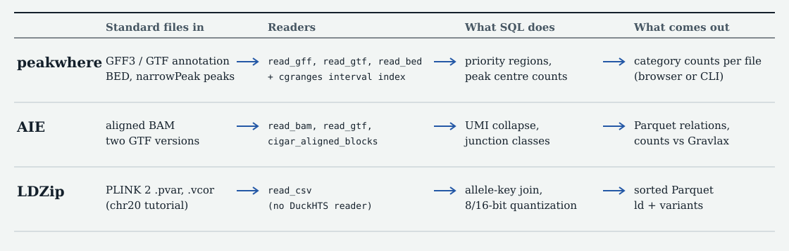

---
output:
  github_document:
    html_preview: false
---

<!-- README.md is generated from README.Rmd. Edit this file and render it with
     Rscript -e 'rmarkdown::render("README.Rmd")'. -->

# duckseq

duckseq rebuilds genomics tools using standard formats such as Parquet, [DuckDB](https://duckdb.org) SQL over [DuckHTS](https://github.com/RGenomicsETL/duckhts) readers, and, where SQL alone is not enough, a small native kernel. Each demo rebuilds one purpose-built tool this way, checks it against the original, and reports where the original still wins.

**Site and reports: <https://rgenomicsetl.github.io/duckseq/>**



## What the evidence shows

Each result is limited to the fixture, workload and machine named in its report.

| Demo | Original | Established | Not established |
|---|---|---|---|
| [peakwhere](https://rgenomicsetl.github.io/duckseq/peakwhere/) ([performance report](https://rgenomicsetl.github.io/duckseq/peakwhere/performance/)) | peakwhere and PeakPeek; ChIPseeker for timing | W1 (7,220 mouse thymus chr19 peaks, GENCODE M25 basic chr19): output matches the independent base-R oracle exactly. Analysis time 0.401 s on one DuckDB thread and 0.370 s multithreaded, against ChIPseeker's 2.776 s; peak RSS 335 MiB multithreaded against 1,198 MiB. | Not an equal-output speedup: ChIPseeker uses different category rules and also finds the nearest transcript. On the larger W2 workload DuckDB is faster but uses more memory (3,297 and 4,903 MiB against 2,143 MiB), and the W2 oracle timed out. No mutation checks reported; no 1×/2×/4× ladder. |
| [AIE](https://rgenomicsetl.github.io/duckseq/aie/) | Gravlax AIE 0.2.3 | A materialized raw-evidence cache with region/junction label and overlap-family queries; independent scalar/graph oracle and four semantic mutants. Real 1M/2M/4M PBMC inputs: 144 fresh CLI processes at one/four threads, all within declared budgets. Separate exact fixture compatibility surface. | Counts intentionally have distinct meanings; no equal-output speedup. Gravlax prepares 4M records in 5.13 s versus 13.10 s at four threads. Full-cohort annotation and general multimapper performance, complete STYLE qualification and an independent annotation-correction policy are unverified. |
| [LDZip](https://rgenomicsetl.github.io/duckseq/ldzip/) | LDZip / LDZipMatrix | Exact 8-bit and 16-bit matrices at nested 1×/2×/4× chr20 regions (250 kb, 500 kb, 1 Mb); six mutation checks; allele-aware composite keys that accept the `CHROM:POS` IDs LDZip rejects. Three fresh processes per cell with predeclared budgets. | LDZip wins dense 5,000-variant extraction (107 ms against 189 ms through DBI at 1×/8-bit) and builds with 20 to 35 times less memory. Pair timings need corrected LDZip batching and equivalent decoded outputs; tag paths include different API/setup work. No compressed LDZip reader on DuckDB; no full-chromosome run. |

The regions are nested spans, not exact row ratios.

## Four standards

A demo is complete only when it has all four. The site's [evidence ledger](https://rgenomicsetl.github.io/duckseq/#ledger) shows which demos meet which.

1. **Shared-surface parity:** exact agreement on the original tool's own test data or tutorial for declared shared semantics. Independently test product policies and explain intentional differences.
2. **Mutation checks:** each rule is implemented wrongly on purpose, and the comparison must fail.
3. **Measured performance:** DuckHTS `STYLE.md` rules, with 1×, 2× and 4× inputs, three fresh processes, peak RSS, and budgets declared before measuring.
4. **Honest contrast:** a table that includes the cases where the original tool wins.

LDZip reports a three-process nested-region scale ladder with RSS and budgets, but its pair comparator needs correction and remeasurement. peakwhere has partial measurements; AIE has real PBMC preparation and serving-cost contrasts with distinct counting policies. See the [LDZip performance review](demos/ldzip/REVIEW.md) for the verified bottlenecks and comparator limits. The separate [native measurements](demos/ldzip/NATIVE_REPORT.md) test SQL-resident matrices at 1/4 threads: at 5,000 variants/16-bit, TinyCC's SQL matrix takes 1,039 ms on one thread or 734 ms on four, against 109 ms for LDZip's R matrix. Direct C consumption takes 103/39.5 ms but returns only checksums. BLAS linking and `dlopen()` pass a small DGEMM correctness check; GEMM throughput is unmeasured.

## Run a demo

All commands run from a clone of this repository.

Peakwhere runs in a browser with vendored DuckDB-Wasm and DuckHTS builds. Files stay on your computer and the page makes no requests outside its own origin:

```sh
cd demos/peakwhere
npm ci
npm run stage && npm run stage:peek && npm run vendor
npm run serve
npm test
```

AIE builds its pinned Gravlax oracle and fetches the DuckDB CLI and DuckHTS extension on first run. It needs Rust and Cargo, R, samtools, jq, curl and unzip:

```sh
cd demos/aie
./setup.sh
./test.sh
./mutation_test.sh
./check_evidence.sh
./prepare_evidence.sh /path/to/input.bam work/input.duckdb sample UR 4
```

LDZip's fixture check needs R, a C++ toolchain, `make`, `curl` and `unzip`:

```sh
cd demos/ldzip
./setup.sh --no-data
./test.sh
```

Its nested-region benchmark downloads the chr20 tutorial VCF:

```sh
cd demos/ldzip
./full_test.sh
./measure_build.sh
./measure_queries.sh
```

## Build the site locally

The site is static HTML and CSS in `site/`, with no framework, external font or script. `scripts/render-site.sh` assembles it, rendering the evidence reports with Pandoc, and `scripts/check-site.mjs` verifies routes, links, same-origin assets and required page content:

```sh
(cd demos/peakwhere && npm ci && npm run stage && npm run stage:peek && npm run vendor)
scripts/render-site.sh _site
node scripts/check-site.mjs _site
```

## Where to read more

- [peakwhere performance report](demos/peakwhere/benchmarks/performance.md), with receipts in [`results.json`](demos/peakwhere/benchmarks/results.json)
- [AIE product report](demos/aie/PRODUCT_REPORT.md), [counting contract](demos/aie/COUNTING_CONTRACT.md), [compatibility report](demos/aie/REPORT.md), [schema](demos/aie/SCHEMA.md) and [fixture notes](demos/aie/fixture/README.md)
- [LDZip report](demos/ldzip/REPORT.md), [performance review](demos/ldzip/REVIEW.md) and [native measurements](demos/ldzip/NATIVE_REPORT.md)
- [Contributor rules](AGENTS.md), including how claims are kept to their evidence

## Licensing

The repository is GPL-2.0-or-later. `demos/peakwhere` retains its MIT licence. Gravlax is BSD-3-Clause and is built from its pinned upstream source; it is not vendored. See each demo's source and licence notices for data and upstream attribution.
