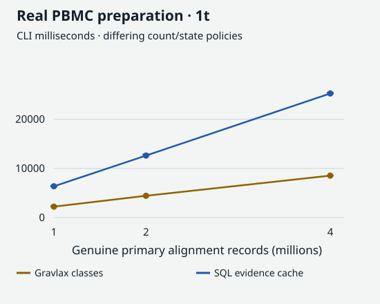
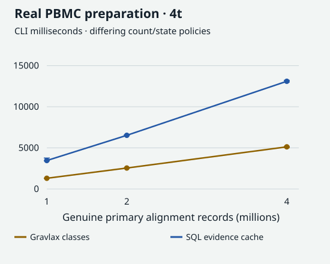
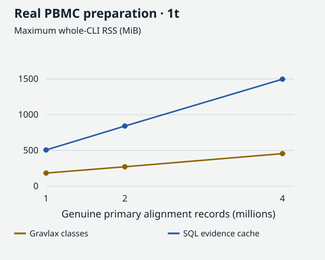
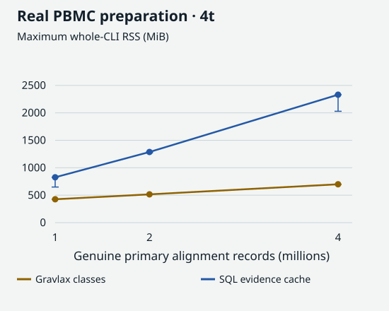
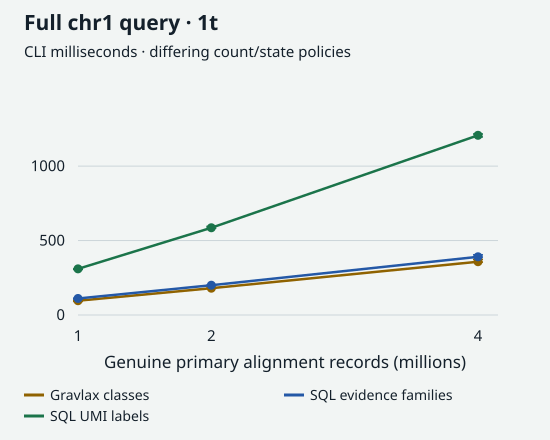
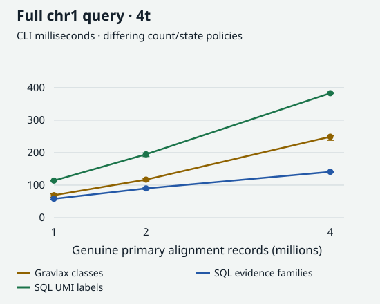
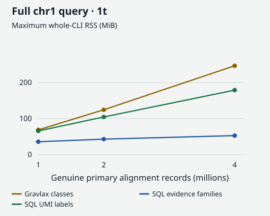
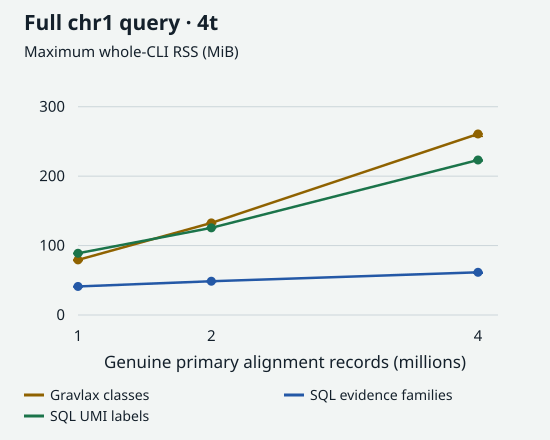

Queryable alignment evidence: real PBMC comparison
================

# Queryable alignment evidence: real PBMC comparison

DuckHTS reads standard BAM; DuckDB prepares inspectable alignment,
CIGAR, junction and evidence-family tables. Region and junction macros
query that serving cache without reparsing CIGAR. Raw and corrected tags
remain distinct.

This product reproduces useful AIE capabilities with an explicit
counting contract, rather than inheriting every Gravlax policy.
Annotation replay remains the demo’s separately scoped [compatibility
surface](REPORT.md); it is not yet an independently validated product
surface.

## Count meanings

- **UMI labels:** exact selected UMI strings per cell and query. They
  are not physical-molecule estimates; a reused UMI in another locus
  remains one label.
- **Evidence families:** exact cell/UMI/contig/strand keys with
  transitively overlapping primary reference spans. No arbitrary 50 kb
  gap or implicit sequence-error absorption. These are inspectable
  evidence groups, not proof of one biological molecule each.
- **Gravlax:** its corrected barcode assignments and UMI-class
  abstraction.

The default trusts supplied CB and retains raw UR for annotation-ready
evidence. An explicit UB cache selects supplied corrected tags. Missing
tags are audited, not silently substituted. See the [counting
contract](COUNTING_CONTRACT.md).

**Different count meanings prevent an equal-output speedup claim.** The
graphs compare costs of the declared products and preserve their
returned counts.

## Actual PBMC input

Source: public 10x Cell Ranger 3.0.0 `pbmc_1k_v3`, a **4.79 GB BAM**
with GRCh38 contig names. The complete source was acquired over HTTPS
with its observed ETag fixed, size checked, `samtools quickcheck`
verified and SHA-256 recorded.

One source pass produces nested **1M / 2M / 4M genuine primary
records**—no read or barcode replication. These inputs retain mapped,
nonsupplementary NH=1 records with all CB/UB/CR/UR tags present. They
are restricted real-cohort prefixes, not the entire cohort and not
general multimapper performance. Source and derived BAMs use an owned
tmpfs cache; prepared states use the local filesystem. The
[protocol](REAL_BENCHMARK_PROTOCOL.md) declares these choices and
budgets before acquisition and measurement.

## Preparation

<figure>

<figcaption aria-hidden="true">Real PBMC preparation with one thread:
the same BAM enters two different retained representations.</figcaption>
</figure>

<figure>

<figcaption aria-hidden="true">Real PBMC preparation with four
threads.</figcaption>
</figure>

<figure>

<figcaption aria-hidden="true">One-thread maximum whole-process RSS for
preparation.</figcaption>
</figure>

<figure>

<figcaption aria-hidden="true">Four-thread maximum whole-process RSS for
preparation.</figcaption>
</figure>

Preparation includes CLI startup, BAM parsing, policy processing and
persisting state. The SQL cache retains raw observations and two
explicit count surfaces; Gravlax retains its dedicated molecular
archive. Prepared bytes are reported below, not treated as
representation parity.

## Full-chromosome query

<figure>

<figcaption aria-hidden="true">One-thread full chr1 query latency. SQL
labels, SQL families and Gravlax classes have different count
meanings.</figcaption>
</figure>

<figure>

<figcaption aria-hidden="true">Four-thread full chr1 query latency;
these are cost contrasts, not equal-output speedups.</figcaption>
</figure>

<figure>

<figcaption aria-hidden="true">One-thread whole-CLI peak RSS for the
full chr1 query.</figcaption>
</figure>

<figure>

<figcaption aria-hidden="true">Four-thread whole-CLI peak RSS for the
full chr1 query.</figcaption>
</figure>

The fixed-window query is `1:1-3000000`; the full query is
`1:1-248956422`. Three fresh processes per point include startup, state
opening, evaluation and writing every cell count. There are no
five-second padding loops. Short query latencies are CLI diagnostics,
not a STYLE timing verdict. Whiskers are the three-run range, not
confidence intervals.

## Validation and biological differences

The product passes an independent scalar CIGAR cursor and pairwise
interval-graph oracle under both tag policies. Tests cover later
introns, D versus N, strand and contig separation, transitive overlaps,
GEM-group identity, missing tags and primary filtering and
variable-length leading-A UMI labels. Real raw-label counts on the
4M-record input’s full-chr1 and 3 Mb queries also match independent
samtools/awk. Four semantic mutants—skip cursor, 50 kb merging, strand
loss and secondary inclusion—disagree with that oracle; restored SQL
passes.

The [real 109,271-record pilot](evidence/real-pilot/README.md) has 653
cell-count differences when using supplied CB/UB. Selecting CB/raw UR
reduces disagreement with Gravlax to **one cell** (28 versus 29). That
cell has three raw barcode variants in the input. This narrows the
remaining investigation; it does not justify relabelling the entire
discrepancy as intentional or demanding blind upstream emulation.

The raw real-comparison rows include output cell counts and count sums
for every query. Returned counts must remain visible alongside
performance.

## Exact data and limitations

| Engine  | Operation              | Records | Threads | Status | CLI ms: median \[min, max\]  | Max RSS MiB | Prepared MiB | Output cells | Count sum |
|:--------|:-----------------------|--------:|--------:|:-------|:-----------------------------|------------:|-------------:|:-------------|:----------|
| gravlax | prepare                |   1e+06 |       1 | PASS   | 2240.0 \[2237.0, 2400.0\]    |       183.0 |          1.8 |              |           |
| sql     | prepare                |   1e+06 |       1 | PASS   | 6375.0 \[6352.0, 6544.0\]    |       506.2 |         69.0 |              |           |
| gravlax | region-full            |   1e+06 |       1 | PASS   | 96.0 \[91.0, 98.0\]          |        68.8 |           NA | 23170        | 322755    |
| sql     | region-full-families   |   1e+06 |       1 | PASS   | 111.0 \[107.0, 113.0\]       |        35.7 |           NA | 23171        | 373870    |
| sql     | region-full-labels     |   1e+06 |       1 | PASS   | 310.0 \[306.0, 310.0\]       |        65.8 |           NA | 23171        | 322759    |
| gravlax | region-window          |   1e+06 |       1 | PASS   | 19.0 \[15.0, 21.0\]          |        18.9 |           NA | 4614         | 42974     |
| sql     | region-window-families |   1e+06 |       1 | PASS   | 38.0 \[28.0, 39.0\]          |        31.1 |           NA | 4615         | 47616     |
| sql     | region-window-labels   |   1e+06 |       1 | PASS   | 53.0 \[50.0, 54.0\]          |        36.0 |           NA | 4615         | 42975     |
| gravlax | prepare                |   2e+06 |       1 | PASS   | 4445.0 \[4412.0, 4446.0\]    |       271.1 |          3.7 |              |           |
| sql     | prepare                |   2e+06 |       1 | PASS   | 12623.0 \[12585.0, 12922.0\] |       840.6 |        137.8 |              |           |
| gravlax | region-full            |   2e+06 |       1 | PASS   | 180.0 \[179.0, 183.0\]       |       124.5 |           NA | 41958        | 641307    |
| sql     | region-full-families   |   2e+06 |       1 | PASS   | 200.0 \[197.0, 201.0\]       |        43.0 |           NA | 41959        | 744884    |
| sql     | region-full-labels     |   2e+06 |       1 | PASS   | 586.0 \[583.0, 595.0\]       |       104.5 |           NA | 41959        | 641317    |
| gravlax | region-window          |   2e+06 |       1 | PASS   | 21.0 \[19.0, 22.0\]          |        19.4 |           NA | 4614         | 42974     |
| sql     | region-window-families |   2e+06 |       1 | PASS   | 33.0 \[30.0, 38.0\]          |        31.4 |           NA | 4615         | 47616     |
| sql     | region-window-labels   |   2e+06 |       1 | PASS   | 55.0 \[55.0, 58.0\]          |        36.1 |           NA | 4615         | 42975     |
| gravlax | prepare                |   4e+06 |       1 | PASS   | 8543.0 \[8540.0, 8557.0\]    |       455.0 |          6.9 |              |           |
| sql     | prepare                |   4e+06 |       1 | PASS   | 25252.0 \[25186.0, 25435.0\] |      1496.4 |        269.8 |              |           |
| gravlax | region-full            |   4e+06 |       1 | PASS   | 358.0 \[355.0, 374.0\]       |       246.7 |           NA | 70260        | 1301501   |
| sql     | region-full-families   |   4e+06 |       1 | PASS   | 391.0 \[389.0, 404.0\]       |        52.8 |           NA | 70262        | 1522290   |
| sql     | region-full-labels     |   4e+06 |       1 | PASS   | 1207.0 \[1196.0, 1216.0\]    |       179.0 |           NA | 70262        | 1301527   |
| gravlax | region-window          |   4e+06 |       1 | PASS   | 22.0 \[19.0, 23.0\]          |        19.2 |           NA | 4614         | 42974     |
| sql     | region-window-families |   4e+06 |       1 | PASS   | 36.0 \[36.0, 39.0\]          |        31.4 |           NA | 4615         | 47616     |
| sql     | region-window-labels   |   4e+06 |       1 | PASS   | 53.0 \[51.0, 53.0\]          |        36.3 |           NA | 4615         | 42975     |
| gravlax | prepare                |   1e+06 |       4 | PASS   | 1306.0 \[1289.0, 1311.0\]    |       426.1 |          1.8 |              |           |
| sql     | prepare                |   1e+06 |       4 | PASS   | 3462.0 \[3427.0, 3768.0\]    |       826.4 |         79.3 |              |           |
| gravlax | region-full            |   1e+06 |       4 | PASS   | 69.0 \[63.0, 73.0\]          |        79.4 |           NA | 23170        | 322755    |
| sql     | region-full-families   |   1e+06 |       4 | PASS   | 58.0 \[56.0, 61.0\]          |        41.1 |           NA | 23171        | 373870    |
| sql     | region-full-labels     |   1e+06 |       4 | PASS   | 114.0 \[113.0, 115.0\]       |        88.9 |           NA | 23171        | 322759    |
| gravlax | region-window          |   1e+06 |       4 | PASS   | 18.0 \[17.0, 22.0\]          |        19.1 |           NA | 4614         | 42974     |
| sql     | region-window-families |   1e+06 |       4 | PASS   | 31.0 \[30.0, 33.0\]          |        32.8 |           NA | 4615         | 47616     |
| sql     | region-window-labels   |   1e+06 |       4 | PASS   | 60.0 \[56.0, 63.0\]          |        41.5 |           NA | 4615         | 42975     |
| gravlax | prepare                |   2e+06 |       4 | PASS   | 2551.0 \[2510.0, 2586.0\]    |       515.5 |          3.7 |              |           |
| sql     | prepare                |   2e+06 |       4 | PASS   | 6529.0 \[6511.0, 6583.0\]    |      1287.1 |        148.8 |              |           |
| gravlax | region-full            |   2e+06 |       4 | PASS   | 117.0 \[113.0, 120.0\]       |       132.7 |           NA | 41958        | 641307    |
| sql     | region-full-families   |   2e+06 |       4 | PASS   | 90.0 \[87.0, 93.0\]          |        48.6 |           NA | 41959        | 744884    |
| sql     | region-full-labels     |   2e+06 |       4 | PASS   | 195.0 \[188.0, 199.0\]       |       125.6 |           NA | 41959        | 641317    |
| gravlax | region-window          |   2e+06 |       4 | PASS   | 16.0 \[15.0, 19.0\]          |        19.1 |           NA | 4614         | 42974     |
| sql     | region-window-families |   2e+06 |       4 | PASS   | 35.0 \[30.0, 37.0\]          |        33.1 |           NA | 4615         | 47616     |
| sql     | region-window-labels   |   2e+06 |       4 | PASS   | 52.0 \[51.0, 55.0\]          |        41.9 |           NA | 4615         | 42975     |
| gravlax | prepare                |   4e+06 |       4 | PASS   | 5128.0 \[5016.0, 5179.0\]    |       699.1 |          6.9 |              |           |
| sql     | prepare                |   4e+06 |       4 | PASS   | 13100.0 \[13014.0, 13209.0\] |      2330.8 |        299.0 |              |           |
| gravlax | region-full            |   4e+06 |       4 | PASS   | 249.0 \[238.0, 252.0\]       |       260.8 |           NA | 70260        | 1301501   |
| sql     | region-full-families   |   4e+06 |       4 | PASS   | 141.0 \[139.0, 142.0\]       |        61.5 |           NA | 70262        | 1522290   |
| sql     | region-full-labels     |   4e+06 |       4 | PASS   | 383.0 \[382.0, 385.0\]       |       223.3 |           NA | 70262        | 1301527   |
| gravlax | region-window          |   4e+06 |       4 | PASS   | 16.0 \[16.0, 18.0\]          |        19.2 |           NA | 4614         | 42974     |
| sql     | region-window-families |   4e+06 |       4 | PASS   | 31.0 \[29.0, 38.0\]          |        33.0 |           NA | 4615         | 47616     |
| sql     | region-window-labels   |   4e+06 |       4 | PASS   | 51.0 \[51.0, 52.0\]          |        42.0 |           NA | 4615         | 42975     |

[Raw rows, logs, source snapshots, input/runtime hashes and acquisition
receipts](evidence/real/) are preserved. Each process has a 180-second
wall ceiling and 4 GiB RSS ceiling; DuckDB uses 2 GiB buffer and 2 GiB
spill limits. Prepared state is capped at 4 GiB. Failures remain in the
table; no retry replaces them.

This is real-input evidence, not full product completion. Whole-cohort
annotation performance, a general multimapper workload and full STYLE
qualification remain unverified. The purpose-built original can still
win: compare its preparation, archive size and restricted-window cost
with the richer SQL evidence cache.

## Reproduce

``` bash
cd demos/aie
./check_evidence.sh
./derive_real.sh /path/to/pbmc_1k_v3.bam /new/ladder
Rscript --vanilla measure_real.R /new/ladder work/new-real-comparison
# One reusable product cache, with explicit tag policy:
./prepare_evidence.sh /path/to/input.bam work/input.duckdb sample UR 4
duckdb work/input.duckdb -c "SELECT * FROM aie_region_families('1',1,3000000);"
```

`DUCKDB` and `DUCKHTS_EXTENSION` select recorded runtime artifacts. Use
new output directories; preserve previous receipts. Render this report
from committed evidence, not by rerunning engines. From the repository
root, `Rscript scripts/plot-benchmarks.R` regenerates the static SVGs.
