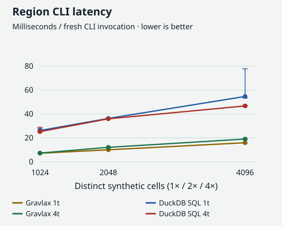
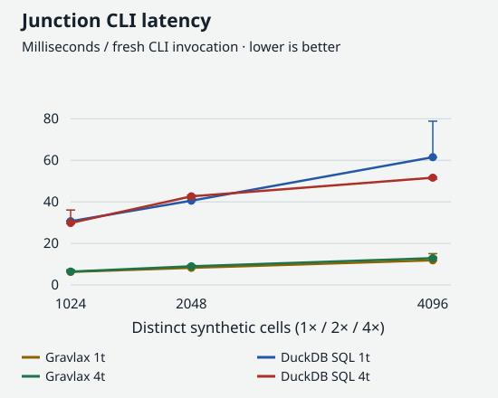
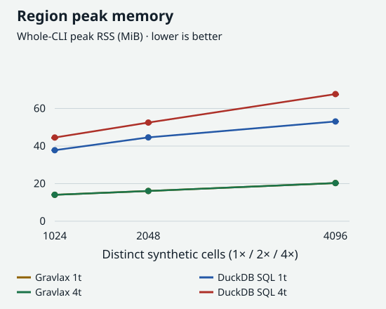
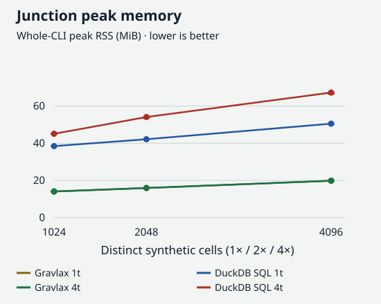
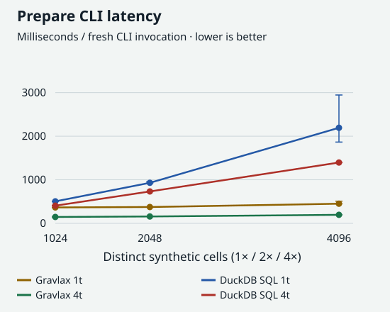
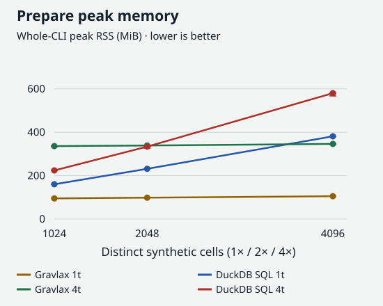

```{r setup, include=FALSE}
knitr::opts_chunk$set(echo=FALSE, message=FALSE, warning=FALSE)
raw <- read.delim("evidence/benchmark/raw.tsv")
stopifnot(nrow(raw)==108L, all(raw$status=="PASS"), all(raw$measured_s>=5))
groups <- split(raw,interaction(raw$engine,raw$operation,raw$cells,raw$threads,drop=TRUE))
summary <- do.call(rbind,lapply(groups,function(d) data.frame(
  Engine=d$engine[[1]], Operation=d$operation[[1]], Cells=d$cells[[1]], Threads=d$threads[[1]],
  `CLI milliseconds: median [min, max]`=sprintf("%.2f [%.2f, %.2f]",median(d$elapsed_s)*1000,min(d$elapsed_s)*1000,max(d$elapsed_s)*1000),
  `Max RSS MiB`=round(max(d$peak_rss_bytes)/1024^2,1),
  `Prepared MiB`=if(all(is.na(d$prepared_bytes)))NA_real_ else round(median(d$prepared_bytes)/1024^2,3),check.names=FALSE)))
```

# Gravlax AIE in DuckDB SQL

DuckHTS reads the BAM and GTF inputs; SQL stores alignment identity, CIGAR
operations, molecule membership and placements in Parquet. Region, junction,
jset, annotation replay and signed annotation deltas match pinned
[Gravlax AIE 0.2.3](https://github.com/COMBINE-lab/Gravlax/tree/75b8d6c01064ba92af295543d50230429774e170)
on the checked-in two-sample fixture. This is fixture parity, not exhaustive
Gravlax compatibility.

## Gravlax comparison

These measurements use **1,024 / 2,048 / 4,096 distinct synthetic cells**. Every
cell has the recorded 28-alignment fixture topology, with unique read names and
cell barcodes. The archived template/source snapshot defines this diagnostic;
the compatibility fixture is tested separately. The record counts scale exactly 1×/2×/4×; the reference remains a
120-base chr1. Both engines receive the same sorted BAM. Every timed region and
junction output is checked as a complete cell/count relation against Gravlax.









These are repeated **fresh-CLI diagnostics**, not resident-engine timings.
Three independent batches per point each accumulate at least five measured
seconds; every invocation starts a new process. Latency is the median of three
batch means, not the median of individual invocations. Whiskers are the range of
batch means, not confidence intervals. RSS covers the entire CLI process.

The synthetic reference and short individual queries do **not** establish
DuckHTS STYLE operating-scale compliance or public-transcriptome throughput.
Annotation replay and jset performance are unmeasured.

## Preparation: different representations

Gravlax writes its AIE archive. DuckDB writes the demo's Parquet relations,
including read metadata, explicit geometry and placements. Both preparations
start from the same BAM, but the retained representations differ; the query
checks establish cell/count parity, not storage-format equivalence.





## Exact measurements and budgets

[Raw batch measurements](evidence/benchmark/raw.tsv), compressed per-invocation
receipts, source/input/runtime hashes and the manifest are in
[evidence/benchmark](evidence/benchmark). Failed invocations are retained and end
the batch; there is no retry. The preliminary, uncontrolled-thread single-CLI
run is not the source of these charts.

The [protocol](BENCHMARK_PROTOCOL.md) declares budgets before the controlled run:
120 seconds and 2 GiB peak RSS per CLI, 2 GiB prepared output per run, 64 MiB per
stdout/stderr receipt. DuckDB has a 1 GiB buffer limit and 512 MiB spill limit.
DuckDB threads and `RAYON_NUM_THREADS` are one/four; BLAS/OpenMP threads are one.
All 108 controlled batches pass the recorded budgets and count-output checks.

```{r measurements}
knitr::kable(summary,row.names=FALSE)
```

## Real-input shared-surface admission: failed

A [public PBMC compatibility pilot](evidence/real-pilot/README.md) contains
109,271 real mapped NH=1 records from GRCh38 `1:1-3000000`. Region counts differ
in **653 of 4,615 cells**: Gravlax totals 42,974, current SQL 41,901. This does not admit a real-input equal-output speed comparison.

The source includes 2,613 raw/corrected barcode disagreements and 1,124
raw/corrected UMI disagreements. Gravlax ingestion consumes raw CR/UR; SQL uses
CB/UB. The fixture makes those tags equal. These observations identify a
compatibility gap without attributing every count discrepancy to one cause.
The pilot was derived by indexed access, not a full-cohort run. Selecting supplied
CB/raw UR reduces disagreement to one cell (28 versus 29). The independently
specified product policy and real 1M/2M/4M-record cost comparison are in the
[product report](PRODUCT_REPORT.md); those counts are not silently substituted
for this compatibility surface.

## Compatibility rules and discriminating tests

- **CIGAR reference cursor:** M, D, N, = and X advance it. Only N contributes a
  splice junction. The fixture checks both later junctions of a multi-intron
  read, including `5M5N5M10N5M`.
- **Alignment identity:** a per-sample alignment ID distinguishes placements
  sharing the same read name and flag. The fixture includes three placements
  of one read, including two secondary records with flag 256.
- **Deletion geometry:** D extends an alignment block; treating it as a splice
  rejects a valid geneD assignment.
- **UMI rank:** candidate parents precede the UMI by descending abundance,
  then ascending packed-value/lexical order. An equal-abundance, smaller UMI
  may be a parent. The 3/1/2 chain and equal-abundance branch/square fixtures
  distinguish abundance, exact-only matching and tie order.
- **Alternative placements:** annotation replay considers secondary placements
  before singleton-gene assignment. Cross-gene alternatives make a molecule
  ambiguous; same-gene alternatives remain assignable.

The mutation suite requires explicit count disagreements with Gravlax. Setup,
SQL parser/binder/runtime failures and timeouts are harness failures, not killed
mutants. Restored SQL must pass after every mutant. See the
[fixture rules and upstream source references](fixture/README.md) and
[schema](SCHEMA.md).

## Contrast

| Question | DuckDB SQL | Gravlax |
|---|---|---|
| Region/junction cell counts on these synthetic inputs | Exact admitted output; inspect latency/RSS charts | Exact reference output; inspect latency/RSS charts |
| Retained data | Composable Parquet metadata, CIGAR and placement relations | Dedicated compact archive and purpose-built queries |
| Annotation replay and signed deltas | Exact parity on both fixture annotation versions | Reference implementation; broader behavior is not established by this fixture |
| Broader shared-semantic input modes | Unverified beyond the fixture and recorded pilot | Original tool; this compatibility surface does not replace its general input pipeline |

## Reproduce

```bash
cd demos/aie
eval "$(./setup.sh)"
./test.sh
./mutation_test.sh
AIE_BENCH_THREADS=1 AIE_BENCH_OUT=work/benchmark-controlled-t1 Rscript --vanilla benchmark.R
AIE_BENCH_THREADS=4 AIE_BENCH_OUT=work/benchmark-controlled-t4 Rscript --vanilla benchmark.R
```

Use new output directories: the harness refuses to overwrite receipts. Render
this report from the committed evidence with
`Rscript -e 'rmarkdown::render("REPORT.Rmd", quiet=TRUE)'`. Benchmark charts are
regenerated from the repository root with `Rscript scripts/plot-benchmarks.R`.
Rendering does not download inputs or run benchmark engines.
