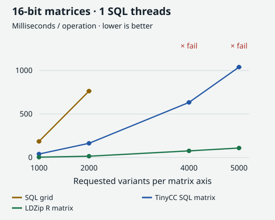
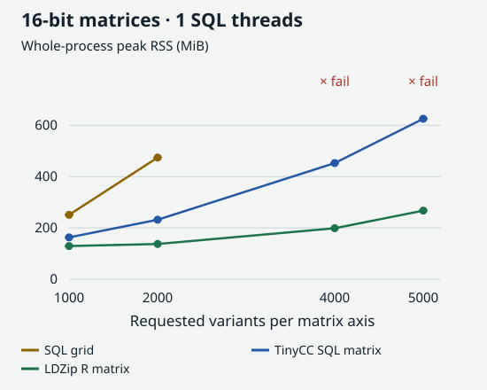
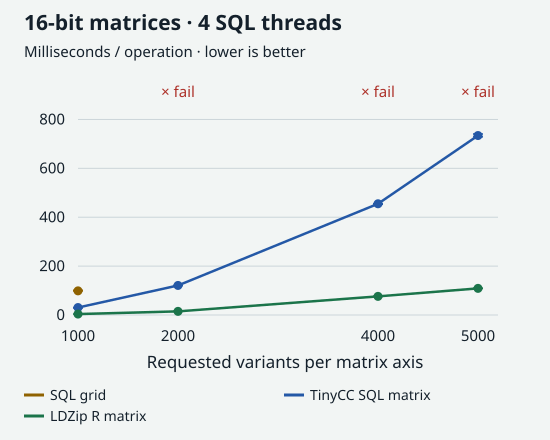
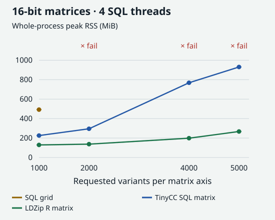

Native LD matrix measurements
================

## Result

Keeping the matrix out of R does not by itself make this implementation
faster. The DuckTinyCC aggregate beats the built-in ordered-grid SQL at
the qualified small sizes, but exporting a complete dense matrix as SQL
lists is substantially slower than LDZip’s R-matrix endpoint. Consuming
the same constructed columns inside C is much cheaper than exporting and
retaining them as SQL values.

The [protocol](NATIVE_PROTOCOL.md) declares the workloads and budgets.
The full dimension ladder contains **90 fresh measured processes**, plus
**15** for the 5,000-variant checkpoint. Each qualified process executes
repeated complete operations for at least five measured seconds. Tables
show the median and range of the **three process-average latencies**,
not individual-operation medians. Peak RSS is the maximum of the three
fresh processes, including runtime/setup and the final profiling
operation.

## Measurements at a glance

<figure>

<figcaption aria-hidden="true">16-bit latency with one SQL thread. LDZip
returns an R matrix; TinyCC and SQL grid retain SQL lists. Whiskers are
three-process ranges; red crosses mark resource failures.</figcaption>
</figure>

<figure>

<figcaption aria-hidden="true">16-bit maximum whole-process RSS with one
SQL thread. Resource failures are marked explicitly.</figcaption>
</figure>

<figure>

<figcaption aria-hidden="true">16-bit latency with four SQL threads.
LDZip remains its single-reader R endpoint; retained output
representations differ.</figcaption>
</figure>

<figure>

<figcaption aria-hidden="true">16-bit maximum whole-process RSS with
four SQL threads. Failed resource qualification is not a successful
timing point.</figcaption>
</figure>

The graphs read archived receipts; they do not rerun engines. Exact
values, failure statuses and admission results remain in the expandable
data tables. The 5,000-variant timing checkpoint was measured only at 16
bits.

## What the endpoints do

- **SQL grid:** generate every requested `(i,j)` cell, left-join
  selected Parquet correlations, float32-equivalent decode, zero fill,
  unit diagonal, and ordered column lists.
- **TinyCC SQL matrix:** aggregate compact selected cells by column,
  construct each full double column in C, copy it into DuckDB’s
  composite output and retain the complete `j, vals DOUBLE[]` relation.
- **LDZip R matrix:** `fetchLD()` returns the complete dense R matrix
  through its native reader.

Every timed operation constructs, fully consumes and releases the
result. SQL uses `sum(list_sum(vals))`; LDZip uses `sum(m)`, without a
second full-matrix checksum temporary or forced GC per operation. R
orchestrates the SQL endpoints and receives only scalar metrics, not
matrix values. The two SQL endpoints are directly comparable; the LDZip
endpoint has a different output representation and is compatibility
context.

## Dimension ladder

The fixed source is the public chr20 tutorial’s nested 4× region, at
both quantizations. Requested dimensions grow 1,000 → 2,000 → 4,000
variants: 1×/2×/4× per axis, with 1×/4×/16× required dense output cells.
This is not a file-row-count ladder. Repeated operations intentionally
use warm OS cache and reused connections; first operations and setup
costs are separately recorded in the raw evidence.

### 16-bit

| Variants | Bits | Endpoint          | Threads | Warm mean ms: median \[min, max\] | Max RSS MiB | Status |
|---------:|-----:|:------------------|--------:|:----------------------------------|------------:|:-------|
|     1000 |   16 | SQL grid          |       1 | 185.2 \[182.5, 185.7\]            |       250.9 | PASS   |
|     1000 |   16 | TinyCC SQL matrix |       1 | 40.1 \[39.6, 40.4\]               |       163.0 | PASS   |
|     1000 |   16 | LDZip R matrix    |       1 | 3.8 \[3.8, 3.9\]                  |       129.2 | PASS   |
|     1000 |   16 | SQL grid          |       4 | 98.8 \[98.4, 101.0\]              |       492.2 | PASS   |
|     1000 |   16 | TinyCC SQL matrix |       4 | 30.6 \[28.5, 30.7\]               |       225.6 | PASS   |
|     2000 |   16 | SQL grid          |       1 | 763.6 \[761.1, 766.1\]            |       474.1 | PASS   |
|     2000 |   16 | TinyCC SQL matrix |       1 | 163.2 \[163.2, 163.7\]            |       231.7 | PASS   |
|     2000 |   16 | LDZip R matrix    |       1 | 14.9 \[14.8, 15.0\]               |       137.3 | PASS   |
|     2000 |   16 | SQL grid          |       4 | not qualified                     |      1024.1 | FAIL   |
|     2000 |   16 | TinyCC SQL matrix |       4 | 120.9 \[119.9, 121.1\]            |       295.3 | PASS   |
|     4000 |   16 | SQL grid          |       1 | not qualified                     |       977.4 | FAIL   |
|     4000 |   16 | TinyCC SQL matrix |       1 | 633.4 \[633.4, 636.4\]            |       452.6 | PASS   |
|     4000 |   16 | LDZip R matrix    |       1 | 76.2 \[75.6, 76.9\]               |       198.6 | PASS   |
|     4000 |   16 | SQL grid          |       4 | not qualified                     |       928.3 | FAIL   |
|     4000 |   16 | TinyCC SQL matrix |       4 | 455.0 \[452.8, 455.5\]            |       768.3 | PASS   |

### 8-bit

| Variants | Bits | Endpoint          | Threads | Warm mean ms: median \[min, max\] | Max RSS MiB | Status |
|---------:|-----:|:------------------|--------:|:----------------------------------|------------:|:-------|
|     1000 |    8 | SQL grid          |       1 | 184.2 \[181.9, 185.1\]            |       251.1 | PASS   |
|     1000 |    8 | TinyCC SQL matrix |       1 | 40.0 \[40.0, 40.0\]               |       163.6 | PASS   |
|     1000 |    8 | LDZip R matrix    |       1 | 3.9 \[3.8, 3.9\]                  |       129.4 | PASS   |
|     1000 |    8 | SQL grid          |       4 | 98.5 \[98.0, 100.9\]              |       494.7 | PASS   |
|     1000 |    8 | TinyCC SQL matrix |       4 | 30.7 \[30.7, 30.9\]               |       224.8 | PASS   |
|     2000 |    8 | SQL grid          |       1 | 758.3 \[756.9, 762.1\]            |       473.8 | PASS   |
|     2000 |    8 | TinyCC SQL matrix |       1 | 162.0 \[161.2, 162.6\]            |       231.7 | PASS   |
|     2000 |    8 | LDZip R matrix    |       1 | 14.5 \[14.5, 14.6\]               |       136.9 | PASS   |
|     2000 |    8 | SQL grid          |       4 | not qualified                     |      1039.4 | FAIL   |
|     2000 |    8 | TinyCC SQL matrix |       4 | 121.2 \[120.5, 121.5\]            |       293.4 | PASS   |
|     4000 |    8 | SQL grid          |       1 | not qualified                     |       976.8 | FAIL   |
|     4000 |    8 | TinyCC SQL matrix |       1 | 636.8 \[635.6, 650.4\]            |       453.0 | PASS   |
|     4000 |    8 | LDZip R matrix    |       1 | 76.3 \[76.2, 76.6\]               |       198.7 | PASS   |
|     4000 |    8 | SQL grid          |       4 | not qualified                     |       928.6 | FAIL   |
|     4000 |    8 | TinyCC SQL matrix |       4 | 451.1 \[450.5, 451.8\]            |       678.6 | PASS   |

At 2,000 variants/four threads, SQL completes but all six processes
exceed the declared **879 MiB RSS ceiling**. At 4,000 variants, SQL
cannot construct the matrix within the **1 GiB DuckDB buffer limit**.
These cells do not receive qualified latency values. All TinyCC and
LDZip matrix cells pass their declared resource budgets; qualified SQL
profiles report no spill. Failed SQL allocations do not have valid
completed profiles.

## 5,000-variant, 16-bit checkpoint

| Variants | Bits | Endpoint          | Threads | Warm mean ms: median \[min, max\] | Max RSS MiB | Status |
|---------:|-----:|:------------------|--------:|:----------------------------------|------------:|:-------|
|     5000 |   16 | SQL grid          |       1 | not qualified                     |      1094.5 | FAIL   |
|     5000 |   16 | TinyCC SQL matrix |       1 | 1039.4 \[1034.4, 1040.6\]         |       625.4 | PASS   |
|     5000 |   16 | LDZip R matrix    |       1 | 108.9 \[108.5, 109.8\]            |       267.3 | PASS   |
|     5000 |   16 | SQL grid          |       4 | not qualified                     |      1418.8 | FAIL   |
|     5000 |   16 | TinyCC SQL matrix |       4 | 734.1 \[728.9, 740.6\]            |       930.5 | PASS   |

The TinyCC matrix endpoint takes **1,039.4 ms** on one thread or **734.1
ms** on four threads; LDZip’s R endpoint takes **108.9 ms**. Their
maximum RSS values are **625.4**, **930.5** and **267.3 MiB**,
respectively. Built-in ordered-grid SQL fails the 1 GiB buffer limit at
both thread counts.

## Native-buffer consumption diagnostic

This variant reuses the selected-cell state and the full C column
constructor, consumes every double inside C, releases the temporary
buffer, and returns only a scalar column checksum. It does **not**
retain a complete matrix in SQL or R. Each thread count uses three fresh
processes and at least five measured seconds per process under the same
byte and wall ceilings.

| Threads | Mean ms: median \[min, max\] | Max RSS MiB | Max DuckDB buffer MiB | Spill bytes |
|--------:|:-----------------------------|------------:|----------------------:|------------:|
|       1 | 103.0 \[101.9, 105.0\]       |       160.0 |                  10.8 |           0 |
|       4 | 39.5 \[35.3, 42.8\]          |       171.9 |                  23.9 |           0 |

The matrix and checksum endpoints return different results. This
diagnostic combines changes to composite-value export, buffer lifetime,
SQL retention and consumption; it cannot attribute their individual
costs or establish a matrix-export or GEMM speedup. It does show that
TinyCC’s arithmetic alone is not the complete cost of the SQL matrix
endpoint.

## Correctness and native-library linkage

The admission checks compare every available output cell against
independently decoded sparse values, including zero fill and the
diagonal. TinyCC passes all 16 size/bit-depth/thread combinations
through 5,000 variants. SQL passes the eight combinations at 1,000 and
2,000; the eight larger combinations are explicit resource failures, not
parity passes. Both endpoints also match actual LDZip matrices exactly
at 1,000 variants and both bit depths. Seeded empty columns, bad
coordinates/quantization, visible NULL failure and a changed diagonal
are checked separately from measured processes.

`probe_blas_link.R` passes all four entries of a small DGEMM using both
explicit BLAS linking and `dlopen()`/`dlsym()` of R’s actual OpenBLAS
0.3.26 provider. It uses R’s integer and Fortran character-length ABI
declarations; the real-only header shim avoids an unused C99 `_Complex`
declaration unsupported by TinyCC. This glibc exposes the dynamic-loader
symbols through libc. It is an ABI/linkage test on a small matrix, **not
a GEMM performance measurement**. TinyCC compiles the C glue; the linked
OpenBLAS provider supplies the numerical routine. No BLAS or SIMD
throughput was measured.

The actual measured environment is R **4.6.0**, DuckDB R **1.5.5**,
LDZipMatrix **1.0**, Linux x86-64 on an **Intel Core i5-13500**. The
local DuckTinyCC build is identified by SHA256
`30054a7da930905f7b530f0ba3c2dce8a1c3ea698c581c6cf7c9c227ed634b49`; its
capabilities were checked in the loaded runtime. Input/source hashes,
complete settings, process metrics and profiles are retained with the
evidence.

## Reproduce

Prepare the existing public-region artifacts with `full_test.sh`, and
provide a recent local DuckTinyCC build with aggregate support.
Compilation runs trusted, unsandboxed C. The installed community
extension may have different capabilities; the local artifact is
supplied explicitly.

``` sh
cd demos/ldzip
export DUCKTINYCC_EXTENSION="$HOME/DuckTinyCC/build/release/ducktinycc.duckdb_extension"
Rscript --vanilla check_native.R
Rscript --vanilla measure_native.R
NATIVE_OUT_DIR=work/perf/native-checkpoint NATIVE_SIZES=5000 NATIVE_BITS=16 \
  Rscript --vanilla measure_native.R

mkdir -p work/perf/native-boundary
for threads in 1 4; do
  for rep in 1 2 3; do
    stem="work/perf/native-boundary/t${threads}-r${rep}"
    OMP_NUM_THREADS=1 OPENBLAS_NUM_THREADS=1 timeout 60s \
      /usr/bin/time -f '%e %M' -o "$stem.time" \
      Rscript --vanilla probe_native_boundary.R "$threads" "$stem.json" \
      > "$stem.log" 2>&1
done; done
OMP_NUM_THREADS=1 OPENBLAS_NUM_THREADS=1 Rscript --vanilla probe_blas_link.R
Rscript --vanilla -e 'rmarkdown::render("NATIVE_REPORT.Rmd")'
```

The matrix suites exit nonzero because SQL budget failures are retained.
Inspect `work/perf/native/raw.tsv`,
`work/perf/native-checkpoint/raw.tsv`, `work/perf/native-admission.tsv`
and `work/perf/native-boundary/raw.tsv`; the scoped raw snapshots and
manifests are also in [evidence/native](evidence/native).

## Not measured

No end-to-end chunk-to-GEMM pipeline, SQL-to-R matrix handoff,
cold-cache latency, downstream SuSiE run, whole-chromosome workload or
optimized matrix-extension alternative is measured here. The timings
characterize these specific queries and the generic TinyCC aggregate
bridge, not the best possible DuckDB-native implementation.

Rducks’ public R batches copy values. A consumer that reads DuckDB
chunks into a native buffer before that conversion, completing
borrowed-vector access before chunk destruction, is proposed but not
implemented.
